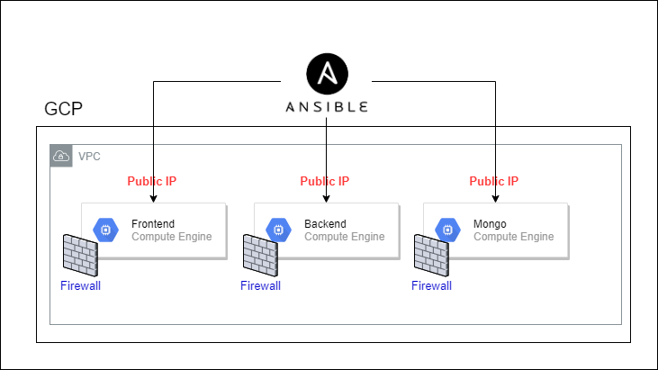

# Terraform-dishout
Terraform-dishout provides the configuration required to create the dishout infrastructure in GCP. 

### Installation

Installing Terraform 0.13.2
```
sh setup/install_terraform.sh
```

Installing Ansible
```
sh setup/install_ansible.sh
```
Installing GCP inventory plugin (required for ansible dynamic invenotry)
```
sh setup/install_gcp_inventory.sh
```
Service account key \
Place the `dishout-285810-a65687753e29.json` file within the credential folder, this will be used by terraform and ansible to authenticate against the GCP account.

SSH keys \
Ssh keys allow you to ssh to the instances locally and will be used by ansible to authenticate against the virtual machine in order to run it's playbook, simply execute these commands to create a pair (this might be removed in the future)
```
ssh-keygen -f credential/dishout-ssh-keys -t rsa -b 4096
sudo chmod 600 credential/dishout-ssh-keys
```

### usage
```
terraform apply
cd provisioner && ansible-playbook playbook.yml
```

### how it works
Upon running *__terraform apply__*  Terraform crates infrastructure within the *___dishout-285810___* GCP project. 
Resources provisioned :  
1. VPC
2. virtual machines 
3. firewalls 
4. static IPs

<!-- Images -->


While provisioning the virtual machines terraform sets the following env variables:
1. DUCKDNS_SUBDOMAIN (*DuckDNS subdomain used to acess the application*)
2. DUCKDNS_TOKEN (*token used to make a request to the duckdns API*)
3. DOCKER_IMAGE (*Image that will be used to run the docker container*)
4. DOCKER_PORT  (*Port docker container will run on*)
5. CONTAINER_NAME (*Name of docker container*)i

##### tfvars
The terraform.tfvars is required in order for secretes.
example .tfvars: 
```
duckdns_token = "*******"
```

Upon running *__cd provisioner && ansible-playbook playbook.yml__*  Ansible provisions the virtual machines by doing the following:
1. setting up DUCKDNS cron script  (*script that notifies duckdns of the public IP of the machine*)
2. Installing docker (*Ansible module geerlingguy.docker is used for this*)
3. running the appropiate docker container (*Does this by using the env variables set by terraform during VM creation*)


<!-- Images -->


#### Extras
##### How is ansible able to provision against newly created machines? how does it get their IP and other data?

This is thanks to ansible *___dynamic invenotry___*, this allows ansible to query resources within the  *___dishout-285810___* GCP project by using the *___service account credentials___*. 
We are able to specify the sets of machines ansible will run a play against by grouping the hosts within our project by label, zone, tag, name, etc (refer to provisioner/inventory.compute.gcp.yml). 
In our case Ansible runs the DuckDNS play on machines with lbael `dns_strategy: duckdns`
*other resources
- [How to Use Ansible Gcp compute inventory](http://matthieure.me/2018/12/31/ansible_inventory_plugin.htmll)
- [How To Setup Ansible Dynamic Inventory For Google Cloud](https://devopscube.com/ansible-dymanic-inventry-google-cloud/l)


The following command allows to query GCP about running instances:
`watch -n 1 ansible-inventory -i inventory.compute.gcp.yml --graph`


