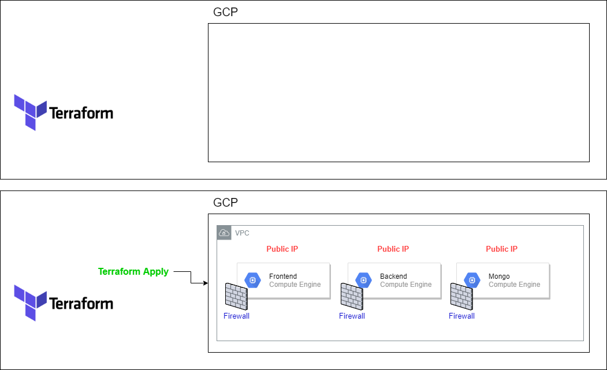

# Terraform-dishout
Terraform infrastructure as code for the Dishout webapp

<!-- Images -->


### Installation
1) Install terraform 0.13.2

2) Create Dishout Project 

3) Service Account(grant "Project editor Role" and generate JSON key)
 
4) Ebable APis
	- Cloud storage
	- Cloud compute
	- Cloud Resource manager


#### Installing Terraform 
```
export VER="0.13.2"
sudo apt install -y curl
sudo apt-get install -y unzip
curl https://releases.hashicorp.com/terraform/${VER}/terraform_${VER}_linux_amd64.zip --output terraform_${VER}_linux_amd64.zip
unzip terraform_${VER}_linux_amd64.zip
mv terraform /usr/local/bin/
rm -rf terraform_${VER}_linux_amd64.zip
terraform -version
```

#### Installing Ansible
```
sudo apt-get update -y
echo "Installing ansible"
sudo apt-get install -y software-properties-common
sudo apt-add-repository -y ppa:ansible/ansible
sudo apt-get update -y
sudo apt-get install -y ansible
sudo apt install --no-install-recommends python-netaddr
ansible-galaxy collection install community.general
ansible --version
```

#### Installing GCP inventory plugin (required for ansible dynamic invenotry)
```
sudo apt install -y python-pip
pip install requests
pip install google-auth
```


#### Extras

###### tfvars
The terraform.tfvars is required in order to for secretes.
example .tfvars: 
```
duckdns_token = "*******"
```

###### SSH keys
ssh-keys are required, simply execure these commands to create a pair (this might be removed)
```
ssh-keygen -f credential/dishout-ssh-keys -t rsa -b 4096
sudo chmod 600 credential/dishout-ssh-keys
```

###### Ansible
the following command allows to query GCP about running instances. 
```
watch -n 1 ansible-inventory -i inventory.compute.gcp.yml --graph
```